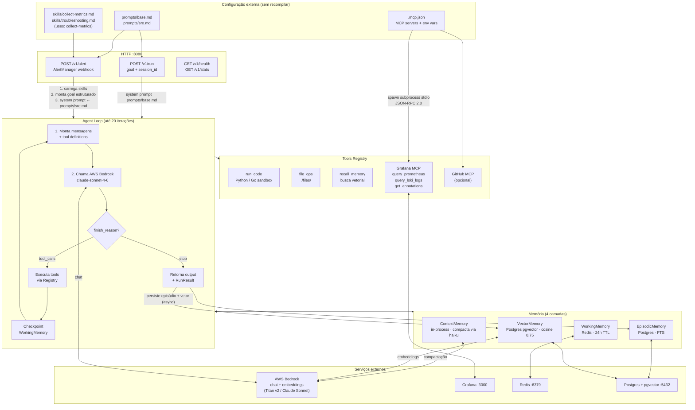
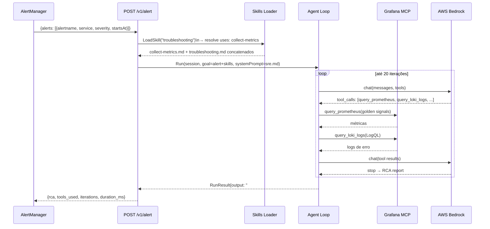

# Agent Service

Agente de IA em Go usando **AWS Bedrock** como backend único para chat e embeddings.
Autenticação via *default credentials chain* do AWS SDK — funciona com `aws sso login`,
`~/.aws/credentials`, env vars, ou IAM roles em produção. Sem API keys próprias.

## Modelo padrão

- **Chat:** `us.anthropic.claude-sonnet-4-6` (cross-region inference profile US)
- **Compactação de contexto:** `us.anthropic.claude-haiku-4-5`
- **Embeddings:** `amazon.titan-embed-text-v2:0` (1024 dims)

## Arquitetura

```
cmd/server/main.go              — Entry point HTTP + wiring
internal/
  bedrock/                      — Cliente AWS Bedrock (chat + embeddings)
  agent/agent.go                — Loop raciocínio → ação → observação
  config/
    mcp.go                      — Loader de .mcp.json e prompts externos
    skills.go                   — Loader de skills com resolução de dependências
  memory/
    context_memory.go           — Janela de tokens ativa (compactação automática)
    working_memory.go           — Estado de sessão no Redis
    vector_memory.go            — Memória semântica via pgvector + Titan v2 embeddings
    episodic_memory.go          — Histórico de runs no Postgres
  tools/
    registry.go                 — Registro de ferramentas
    builtin.go                  — run_code (Python + Go), file_ops
  mcp/client.go                 — Cliente MCP stdio (subprocess)
prompts/
  base.md                       — System prompt do agente genérico
  sre.md                        — System prompt do agente SRE
skills/
  collect-metrics.md            — Skill: coleta dos 4 golden signals via Grafana
  troubleshooting.md            — Skill: correlação de métricas e RCA (depende de collect-metrics)
.mcp.json                       — Configuração de MCP servers (sem código)
```

## Setup rápido

```bash
# 1. Logar no AWS CLI (SSO ou credenciais estáticas)
aws sso login            # ou: aws configure
export AWS_REGION=us-east-1
# (opcional) export AWS_PROFILE=meu-profile

# 2. Subir infraestrutura
docker-compose up -d postgres redis

# 3. Rodar localmente
go run ./cmd/server

# 4. Ou subir tudo com Docker
# (o compose monta ~/.aws como volume read-only no container)
docker-compose up --build
```

### Variáveis de ambiente

| Variável | Default | Descrição |
|----------|---------|-----------|
| `AWS_REGION` | `us-east-1` | Região AWS para Bedrock |
| `AWS_PROFILE` | `default` | Profile do `~/.aws/config` |
| `BEDROCK_MODEL` | `us.anthropic.claude-sonnet-4-6` | Modelo de chat |
| `BEDROCK_EMBED_MODEL` | `amazon.titan-embed-text-v2:0` | Modelo de embedding |
| `DATABASE_URL` | — | Postgres com pgvector |
| `REDIS_ADDR` | `localhost:6379` | Working memory |
| `FILES_BASE_DIR` | `./files` | Sandbox para `file_ops` |
| `PORT` | `8080` | Porta HTTP |
| `GITHUB_TOKEN` | — | Opcional; ativa MCP GitHub |

> **Credenciais:** o SDK Go v2 resolve nesta ordem: env vars (`AWS_ACCESS_KEY_ID`/`AWS_SECRET_ACCESS_KEY`/`AWS_SESSION_TOKEN`) → sessão SSO (`~/.aws/sso/cache/`, populada por `aws sso login`) → `~/.aws/credentials` → assume-role → IMDS/IRSA.

## Endpoints

### POST /v1/run — agente genérico

```bash
curl -X POST http://localhost:8080/v1/run \
  -H "Content-Type: application/json" \
  -d '{"session_id": "sess-001", "goal": "Calcule os primeiros 20 números de Fibonacci"}'
```

Resposta:
```json
{
  "session_id": "sess-001",
  "output": "...",
  "iterations": 2,
  "tools_used": ["run_code"],
  "duration_ms": 3200
}
```

### POST /v1/alert — agente SRE (webhook AlertManager / Grafana Alerting)

Recebe um evento de alerta, executa as skills de coleta de métricas e troubleshooting, e retorna um relatório de Root Cause Analysis.

```bash
curl -X POST http://localhost:8080/v1/alert \
  -H "Content-Type: application/json" \
  -d '{
    "alerts": [{
      "status": "firing",
      "labels": {"alertname": "HighErrorRate", "service": "api", "severity": "critical"},
      "annotations": {"description": "Taxa de erros 5xx acima do threshold"},
      "startsAt": "2026-05-08T10:00:00Z",
      "fingerprint": "abc123"
    }]
  }'
```

Resposta:
```json
{
  "session_id": "sre-alert-abc123",
  "alert": "HighErrorRate",
  "rca": "## Root Cause\n...\n## Impact\n...\n## Timeline\n...\n## Remediation Steps\n...",
  "iterations": 8,
  "tools_used": ["query_prometheus", "query_loki_logs", "get_annotations"],
  "duration_ms": 42000
}
```

O `session_id` é derivado do `fingerprint` do alerta — se o mesmo alerta disparar novamente, o agente retoma de onde parou (via WorkingMemory no Redis).

### GET /v1/health — healthcheck
### GET /v1/stats — métricas de runs (total, success rate, avg duration)

## Configuração de MCP Servers

MCP servers são configurados em `.mcp.json`, sem necessidade de alterar código. Valores `${VAR}` são expandidos a partir das variáveis de ambiente.

```json
{
  "mcpServers": {
    "grafana": {
      "command": "uvx",
      "args": ["mcp-grafana"],
      "env": {
        "GRAFANA_URL": "${GRAFANA_URL}",
        "GRAFANA_SERVICE_ACCOUNT_TOKEN": "${GRAFANA_SERVICE_ACCOUNT_TOKEN}"
      }
    },
    "github": {
      "command": "npx",
      "args": ["-y", "@modelcontextprotocol/server-github"],
      "env": {
        "GITHUB_TOKEN": "${GITHUB_TOKEN}"
      }
    }
  }
}
```

Servers cujas env vars estiverem vazias são ignorados automaticamente na inicialização.

## Skills

Skills definem workflows reutilizáveis em arquivos `.md` dentro de `skills/`. Uma skill pode declarar dependências de outras skills via frontmatter — o loader resolve e concatena na ordem correta (dependências primeiro).

```
skills/
  collect-metrics.md    — 4 golden signals + logs + anotações de deploy
  troubleshooting.md    — correlação, 5 Whys, RCA (uses: collect-metrics)
```

**Formato de uma skill:**

```markdown
---
name: minha-skill
description: O que ela faz
uses: collect-metrics
---

## Skill: Minha Skill
...instruções para o agente...
```

Para criar uma nova skill, adicione o arquivo em `skills/` e carregue com:

```go
skill, err := config.LoadSkill("skills", "minha-skill")
```

## Prompts

Os system prompts ficam em `prompts/` e são carregados em runtime — editar o arquivo não exige recompilação nem restart.

| Arquivo            | Usado em           |
|--------------------|--------------------|
| `prompts/base.md`  | `POST /v1/run`     |
| `prompts/sre.md`   | `POST /v1/alert`   |

## Tools disponíveis (builtin)

| Tool            | Descrição                                |
|-----------------|------------------------------------------|
| `run_code`      | Executa Python ou Go em sandbox local    |
| `file_ops`      | Lê, escreve e lista arquivos             |
| `recall_memory` | Busca semântica nas memórias do agente   |

Tools adicionais são registradas automaticamente via MCP servers configurados em `.mcp.json`.

## Memória

| Camada     | Backend  | Duração    | Uso                                        |
|------------|----------|------------|--------------------------------------------|
| In-context | Tokens   | Por turno  | Conversa ativa (compacta via claude-haiku) |
| Working    | Redis    | 24h TTL    | Estado e checkpoints de tarefas            |
| Semântica  | pgvector | Permanente | Conhecimento indexado por embedding        |
| Episódica  | Postgres | Permanente | Histórico de runs e auditoria              |

## Arquitetura — Diagrama de fluxo



## Fluxo do alerta SRE



## Observabilidade

| Serviço    | URL                    |
|------------|------------------------|
| Jaeger     | http://localhost:16686 |
| Prometheus | http://localhost:9090  |
| Grafana    | http://localhost:3000  |
